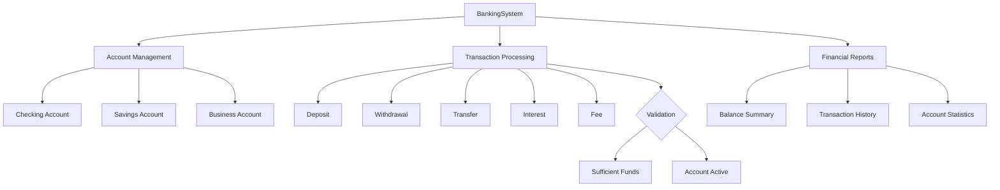

# Java Banking System

<div align="center">


</div>


[English](#english) | [Portugues](#portugues)

---

## Portugues

Sistema bancario em Java com gerenciamento de contas (corrente, poupanca, empresarial), operacoes de deposito, saque e transferencia, aplicacao de juros e historico completo de transacoes.

### Arquitetura



### Funcionalidades

- Contas: corrente, poupanca e empresarial com saldos sincronizados
- Operacoes: deposito, saque, transferencia entre contas, aplicacao de juros
- Validacao de fundos e estado da conta em cada transacao
- Historico completo de transacoes com status de sucesso/falha
- Relatorios: saldo total, transacoes por tipo, distribuicao de contas
- Operacoes thread-safe com blocos synchronized

### Como Executar

```bash
mvn compile
mvn exec:java -Dexec.mainClass="com.galafis.banking.BankingSystem"
```

---

## English

Banking system in Java with account management (checking, savings, business), deposit/withdrawal/transfer operations, interest application, and complete transaction history.

### Architecture


### Features

- Account types: checking, savings, and business with synchronized balances
- Operations: deposit, withdrawal, inter-account transfer, interest application
- Fund and account state validation on every transaction
- Complete transaction history with success/failure status
- Reports: total balance, transactions by type, account distribution
- Thread-safe operations with synchronized blocks

### How to Run

```bash
mvn compile
mvn exec:java -Dexec.mainClass="com.galafis.banking.BankingSystem"
```

## Author

Gabriel Demetrios Lafis

## License

MIT License
